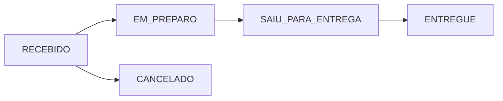

<div align="center">

# 🚚 Mini Rastreador de Pedidos

### API REST para gerenciamento de pedidos de delivery

*Cadastro de usuários, autenticação, criação e acompanhamento de pedidos com atualização de status em tempo real.*

</div>

---

Projeto desenvolvido como **desafio técnico** utilizando **Java + Spring Boot**, seguindo boas práticas de organização em camadas (Controller → Service → Repository → Model/DTO).

<br>

## 📌 Índice

- [Funcionalidades](#-funcionalidades)
- [Fluxo de status do pedido](#-fluxo-de-status-do-pedido)
- [Arquitetura](#️-arquitetura-do-projeto)
- [Tecnologias](#️-tecnologias-utilizadas)
- [Modelo de dados](#️-modelo-de-dados)
- [Configuração e execução](#️-configuração-do-projeto)
- [Endpoints da API](#-endpoints)
- [Segurança](#-segurança)
- [Próximas melhorias](#-próximas-melhorias)
- [Autor](#-autor)

<br>

## 📌 Funcionalidades

### 👤 Usuários

| Funcionalidade | Descrição |
|---|---|
| Cadastro | Criação de usuário com validação de e-mail duplicado |
| Login | Autenticação via e-mail e senha |
| Segurança | Senhas criptografadas com **BCrypt** |

### 📦 Pedidos

| Funcionalidade | Descrição |
|---|---|
| Criar pedido | Associa cliente, itens e endereço de entrega |
| Listar pedidos | Retorna todos os pedidos cadastrados |
| Buscar por ID | Consulta detalhada de um pedido específico |
| Atualizar status | Avança o pedido no fluxo de entrega |

<br>

## 🚦 Fluxo de status do pedido



<br>

## 🏗️ Arquitetura do Projeto

Organização em camadas, seguindo o padrão do Spring Boot:

```text
src/main/java/com/geandro/rastreador
│
├── 🎮 controller     → Endpoints REST
├── ⚙️ service        → Regras de negócio
├── 🗄️ repository     → Comunicação com o banco de dados
├── 🧩 model          → Entidades JPA
├── 📦 dto            → Objetos de transferência de dados
└── 🔐 security       → Configurações de autenticação
```

<br>

## 🛠️ Tecnologias utilizadas

<table>
<tr>
<td valign="top" width="33%">

**Backend**
- Java 17+
- Spring Boot 3
- Spring Web
- Spring Data JPA
- Spring Security
- Hibernate
- Maven

</td>
<td valign="top" width="33%">

**Banco de Dados**
- MySQL

</td>
<td valign="top" width="33%">

**Ferramentas**
- Spring Tool Suite (STS)
- Eclipse
- Postman
- Git / GitHub

</td>
</tr>
</table>

<br>

## 🗄️ Modelo de Dados

<details>
<summary><strong>👤 Usuario</strong></summary>

| Campo | Tipo |
|---|---|
| id | Long |
| nome | String |
| email | String |
| senha | String |

</details>

<details>
<summary><strong>📦 Pedido</strong></summary>

| Campo | Tipo |
|---|---|
| id | Long |
| dataPedido | LocalDateTime |
| status | Enum |
| cliente | Usuario |
| enderecoEntrega | EnderecoEntrega |
| itens | List\<ItemPedido\> |

</details>

<details>
<summary><strong>🛒 ItemPedido</strong></summary>

| Campo | Tipo |
|---|---|
| id | Long |
| produto | String |
| quantidade | Integer |
| preco | BigDecimal |
| pedido | Pedido |

</details>

<details>
<summary><strong>📍 EnderecoEntrega</strong></summary>

| Campo | Tipo |
|---|---|
| id | Long |
| rua | String |
| numero | String |
| bairro | String |
| cidade | String |
| complemento | String |

</details>

<br>

## ⚙️ Configuração do Projeto

### ✅ Pré-requisitos

- Java 17+
- Maven
- MySQL

### 🗃️ 1. Criar o banco de dados

```sql
CREATE DATABASE pedidos_db;
```

### 🔧 2. Configurar `application.properties`

```properties
spring.datasource.url=jdbc:mysql://localhost:3306/pedidos_db
spring.datasource.username=root
spring.datasource.password=SUA_SENHA

spring.jpa.hibernate.ddl-auto=update
spring.jpa.show-sql=true
```

### ▶️ 3. Clonar e executar

```bash
git clone https://github.com/seuusuario/rastreador.git
cd backend
mvn spring-boot:run
```

A API estará disponível em:

```text
http://localhost:8080
```

<br>

## 🔌 Endpoints

### 👤 Usuários

<details>
<summary><strong>POST</strong> /usuarios/cadastro — Cadastrar usuário</summary>

```json
{
  "nome": "João Silva",
  "email": "joao@email.com",
  "senha": "123456"
}
```

</details>

<details>
<summary><strong>POST</strong> /usuarios/login — Autenticar usuário</summary>

```json
{
  "email": "joao@email.com",
  "senha": "123456"
}
```

</details>

### 📦 Pedidos

<details>
<summary><strong>POST</strong> /pedidos — Criar pedido</summary>

```json
{
  "clienteId": 1,
  "itens": [
    {
      "produto": "Pizza",
      "quantidade": 2,
      "preco": 40
    }
  ],
  "enderecoEntrega": {
    "rua": "Rua A",
    "numero": "100",
    "bairro": "Centro",
    "cidade": "São Paulo"
  }
}
```

</details>

<details>
<summary><strong>GET</strong> /pedidos — Listar todos os pedidos</summary>

```http
GET /pedidos
```

</details>

<details>
<summary><strong>GET</strong> /pedidos/{id} — Buscar pedido por ID</summary>

```http
GET /pedidos/1
```

</details>

<details>
<summary><strong>PUT</strong> /pedidos/{id}/status — Atualizar status do pedido</summary>

```http
PUT /pedidos/1/status?status=EM_PREPARO
```

</details>

<br>

## 🔐 Segurança

As senhas dos usuários **nunca** são armazenadas em texto puro. O sistema utiliza `BCryptPasswordEncoder` para criptografia.

| Senha enviada | Armazenada (hash) |
|---|---|
| `123456` | `$2a$10$7x8sK......` |

<br>

## 📚 Próximas melhorias

- [ ] Implementação de JWT Token
- [ ] Controle de acesso por usuário autenticado
- [ ] Swagger / OpenAPI
- [ ] Tratamento global de exceções
- [ ] Paginação de pedidos
- [ ] Testes unitários
- [ ] Dockerização da aplicação
- [ ] Deploy em cloud

<br>

## 👨‍💻 Autor

<div align="center">

**Geandro Araujo**

Projeto desenvolvido para estudo e demonstração de conhecimentos em desenvolvimento Backend Java.

</div>